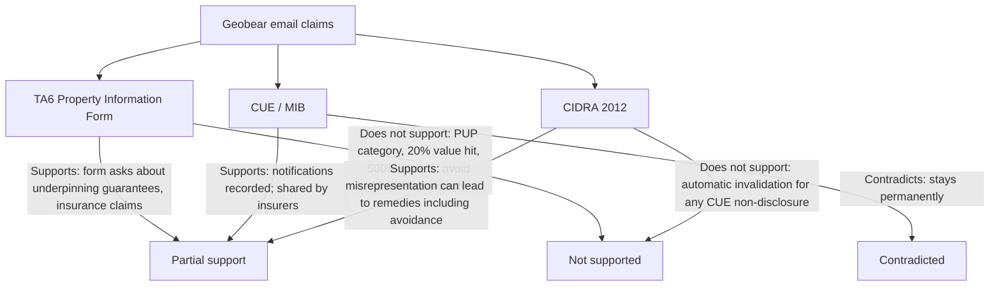

# Fact-check: Geobear resin-injection “disclosability” claims

**Date:** 31 July 2026  
**Scope:** Sales email summary about Geobear geopolymer injection vs TA6 / CUE / CIDRA  
**Sources checked:** Law Society TA6 Property Information Form (5th Edition); Claims and Underwriting Exchange (CUE), Motor Insurers’ Bureau; Consumer Insurance (Disclosure and Representations) Act 2012

---

## Bottom line

Parts of the email are directionally right: CUE works roughly as described; privately funded work with no insurer notification usually creates no CUE entry; underpinning/subsidence history can hurt value, mortgages, and insurance. The sales pitch **overstates** what the three cited sources say. The claim that Geobear’s treatment **“avoids this entirely”** is **misleading**. Known subsidence history and remedial work still matter on sale and for insurance.

---

## The claims under review

The company stated, in summary:

1. Geopolymer injection is **ground improvement, not underpinning**, so **no PUP declaration** is required on property information forms.
2. A PUP declaration can cut resale value by **up to 20%**, make mortgages harder, and lead insurers to raise excess by **up to 500%** or refuse cover.
3. Notifying an insurer of potential subsidence creates a **permanent** CUE record that must be disclosed later; going direct with Geobear avoids a claim and a CUE entry.
4. Failure to disclose a CUE entry can **invalidate** a policy under CIDRA 2012.
5. Insurance subsidence claims take **1–2 years**; Geobear can close treatment in **weeks**.

---

## Claim-by-claim

### 1. “No PUP declaration required” / “ground improvement, not underpinning” / “avoids this entirely”

**Verdict: Partly true on wording; misleading on effect**

| What they say | What sources support |
| --- | --- |
| Work is “ground improvement,” not traditional underpinning | Engineering/marketing distinction is common; resin injection does not dig new foundations like mass concrete underpinning. There is **no Law Society TA6 rule** that invents a formal “PUP” tick-box or classifies Geobear as exempt. “PUP” is industry slang (Previously Underpinned Property), not a TA6 field. |
| Does not need to be declared as PUP on property information forms | TA6 asks about things like **unexpired guarantees for underpinning** (e.g. section 6.1(g) in common editions), **buildings insurance claims**, and **difficulty obtaining insurance**. It does not say “ground improvement = no disclosure.” |
| “Geobear’s treatment avoids this entirely” | **Misleading.** Geobear’s own guidance ([subsidence property guide](https://www.geobear.com/en-gb/subsidence-property-guide)) says you **must** declare past/present subsidence on TA6, with no time limit. Buyer solicitors routinely ask about foundation/subsidence works and guarantees. A guarantee for resin work would typically be disclosed under guarantees (“underpinning” or “other”). |

**Practical takeaway:** Calling it “not underpinning” may avoid answering “yes” to a narrow “has it been underpinned?” enquiry if asked only that. It does **not** wipe out disclosure of known movement, repairs, guarantees, or related insurance history.

**Relevant TA6 content (5th edition pattern):**

- Guarantees: unexpired warranties including **(g) underpinning** and **(i) other**
- Insurance: whether cover was hard to obtain / special conditions; whether buildings insurance claims were made
- Sellers’ answers are relied on by buyers; incomplete or misleading answers can delay a sale or support a later claim

---

### 2. TA6 asks about underpinning / strengthening / structural repair; PUP hurts value, mortgages, insurance

**Verdict: Directionally true on stigma; numbers not from the cited sources**

- **TA6:** Sellers must answer honestly about guarantees (including underpinning), insurance claims, and related matters. Broader “strengthening or structural repair” is a fair summary of what conveyancers care about, but that phrasing is not a verbatim TA6 heading that creates a “PUP” declaration.
- **“Reduce resale value by up to 20%”:** Plausible as an **upper-end market anecdote** for underpinned/subsidence-history homes (published estimates often cite roughly 5–25% depending on age, paperwork, and recurrence). **Not stated in TA6, CUE, or CIDRA.**
- **Harder to get a mortgage:** Often true where there is unresolved or poorly documented subsidence/underpinning; many lenders accept well-documented remediated properties. Not a TA6 rule.
- **Excess up by “up to 500%” or refuse cover:** Standard subsidence excess is often ~£1,000; higher excesses (e.g. £2,500–£5,000) and refusals do occur for history properties. “Up to 500%” is a sales-style ceiling, **not** something the three cited sources establish. ABI guidance is that members try to keep cover where possible after repair.

---

### 3. CUE entry when you notify insurer; “stays permanently”; must disclose later

**Verdict: Mostly true, except “permanently”**

Supported by CUE / MIB material (MIB subject-access guidance; Experian CUE overview):

- CUE is a shared UK insurer database, managed via the Motor Insurers’ Bureau.
- It records **incidents notified** to insurers, **whether or not a claim is paid**.
- Going **direct and private** (no insurer notification) means **no CUE entry from that route** — that part of the pitch is generally correct.

**False / overstated:** Home/motor CUE records are held for about **six years from when the claim or notification is closed**, not “permanently.” (Personal injury CUE can be longer; that is a different category.)

Also: many policies require you to notify damage/incidents. Skipping the insurer to “keep CUE clean” may avoid a CUE mark, but it is a **commercial/policy-risk choice**, not something the cited sources bless as a disclosure loophole for sale.

---

### 4. Failure to disclose a CUE entry can “invalidate” cover under CIDRA 2012

**Verdict: Overstated**

[CIDRA 2012 s.2](https://www.legislation.gov.uk/ukpga/2012/6/section/2) imposes a duty to **take reasonable care not to make a misrepresentation** when answering the insurer (it replaced the old “volunteer every material fact” duty for consumers).

- Wrong answers to questions about claims/incidents can give the insurer remedies.
- Full avoidance (treat as never insured) is mainly for **deliberate or reckless** qualifying misrepresentations; **careless** ones usually get **proportionate** remedies ([Schedule 1](https://www.legislation.gov.uk/ukpga/2012/6/schedule/1/enacted)).
- So “can invalidate entirely” is possible in serious cases, but the email’s absolute wording is **stronger than the Act**.

---

### 5. Insurance claims take 1–2 years; Geobear closes in weeks

**Verdict: Plausible industry comparison; not in the three sources**

Subsidence claims often involve investigation and monitoring over many months (sometimes longer than a year). Resin injection is typically days to a few weeks on site. That contrast is widely repeated; it is **not** established by TA6, CUE, or CIDRA.

---

## How well the three cited sources back the email

1. **Law Society TA6 (5th ed.)** — Supports that sellers must answer honestly about guarantees (including underpinning), insurance claims, and related matters. Does **not** support “no disclosure if resin / ground improvement,” nor the 20% / 500% figures.
2. **CUE (MIB)** — Supports notification → database entry used by insurers. Contradicts **permanent** retention for home incidents (**~6 years**).
3. **CIDRA 2012** — Supports careful answering of insurer questions; does **not** say every failure to mention a CUE entry automatically voids a policy.

---

## Scorecard

| Claim | Verdict |
| --- | --- |
| Ground improvement ≠ traditional underpinning | Partly true (engineering label) |
| No “PUP” box / no need to declare as PUP | Narrowly arguable; “PUP” is not a TA6 field |
| Treatment “avoids disclosure entirely” | **Misleading** |
| Up to 20% resale hit | Market anecdote; not in cited sources |
| Harder mortgages / insurance | Directionally true for history properties |
| Excess up to 500% / refuse cover | Possible upper end; not from cited sources |
| Notify insurer → CUE entry | True |
| CUE stays permanently | **False** (~6 years for home) |
| Private Geobear job → no CUE from that route | Generally true if no notification |
| Non-disclosure of CUE always invalidates under CIDRA | **Overstated** |
| Claims 1–2 years vs weeks with Geobear | Plausible; not from cited sources |

---

## Short answers

- **Is “not underpinning so no PUP on TA6” true?** Narrowly arguable as a label; **not** a clean legal get-out. Subsidence, works, guarantees, and claims still need honest answers where asked.
- **Does private Geobear work avoid a CUE entry?** Usually **yes**, if you never notify the insurer — that is the strongest accurate part of the pitch.
- **Does that keep the property’s “insurance history clean” forever?** No CUE mark from that job; it does **not** erase the need to disclose known structural/subsidence issues on sale, and CUE itself is not permanent.
- **Are the 20% / mortgage / 500% excess lines from those sources?** **No** — they are sales/market claims bolted onto real stigma around underpinning/subsidence history.

---

## Source links

1. [Law Society Transaction (TA) forms](https://www.lawsociety.org.uk/topics/property/transaction-forms) — TA6 Property Information Form
2. [MIB — requesting your data / CUE](https://www.mib.org.uk/making-a-claim/managing-your-data/) — retention (~6 years from closure for home/motor)
3. [Experian CUE overview](https://www.experian.co.uk/insurance/cue/shared/html/cue_mnu_overview.htm) — incidents notified, may or may not become claims
4. [CIDRA 2012](https://www.legislation.gov.uk/ukpga/2012/6) — duty and remedies
5. [Geobear — buying/selling with subsidence](https://www.geobear.com/en-gb/subsidence-property-guide) — company’s own TA6 disclosure guidance

---

*This note is research against publicly available sources, not legal advice. For a live sale or policy decision, a conveyancing solicitor and (if relevant) an insurance broker should review the actual TA6 answers and policy wording.*
